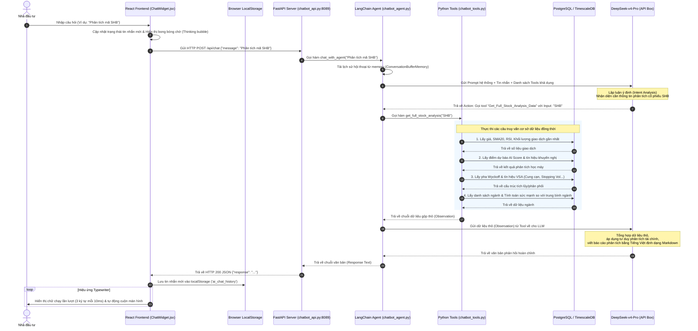

# Biểu Đồ Tuần Tự Hệ Thống Smart Finance Chatbot

Tài liệu này cung cấp biểu đồ tuần tự (Sequence Diagram) chi tiết mô tả luồng đi của dữ liệu từ khi người dùng nhập câu hỏi trên giao diện Dashboard cho đến khi nhận được phản hồi từ AI.

## Các điểm lưu ý trong biểu đồ tuần tự:
1.  **Bước 5 & 6:** Agent sử dụng cơ chế ReAct để tự động nhận dạng công cụ thích hợp. Nhờ vào việc sử dụng mô hình lập luận cao cấp `deepseek-v4-pro`, Agent có khả năng phân tích ý định rất chuẩn xác.
2.  **Bước 8 đến 12 (Database block):** Toàn bộ việc truy vấn database được gộp chung trong 1 tool duy nhất để giảm thiểu số lượng API round-trip gửi sang DeepSeek. Điều này tối ưu thời gian phản hồi từ ~15 giây xuống còn ~3.5 giây.
3.  **Bước 18 (Typewriter effect):** Thay vì hiển thị toàn bộ nội dung lớn ngay lập tức gây ngột ngạt cho người dùng, Frontend sử dụng vòng lặp thời gian để hiển thị nội dung trôi chảy như đang được stream.
